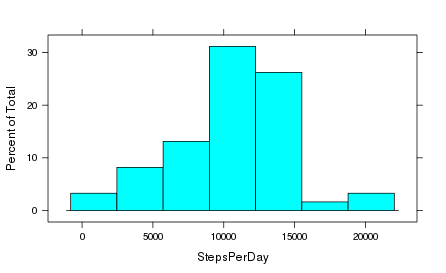
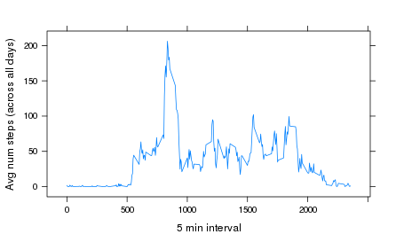
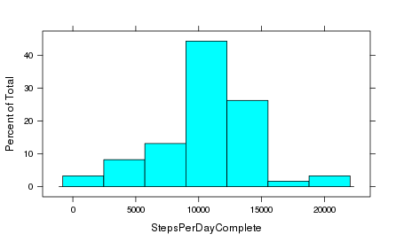
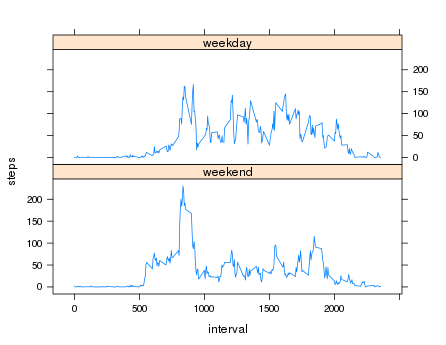

https://github.com/develHector/RepData_PeerAssessment1  

###Loading and preprocessing the data###
Download the file in case it's not on the current directory

```r
downloadFile <- "activity.zip";
url <- "https://d396qusza40orc.cloudfront.net/repdata/data/activity.zip";
if( !file.exists(downloadFile) ) download.file( url, downloadFile, method = "curl" );
```
Unzip it in memory, and process/transofrm the zip onto raw data

```r
dataFile <- "activity.csv";
FileCon <- unz( downloadFile, dataFile );
RawData <- read.csv( FileCon, header=TRUE, nrows=17568 );
```

###Mean total number of steps taken per day###
Calculate the total number of steps taken per day  (I'll remove intervals without data)

```r
# na.rm=TRUE fattens the left tail
StepsPerDay <- with( RawData, tapply( steps, date, sum, na.rm=FALSE ) )  ; 
```

Make a histogram of the total number of steps taken each day

```r
library( lattice ) ; # I chose this just because of the parameterless nice colored graphs
histogram( StepsPerDay ) ;
```



Calculate and report the mean and median of the total number of steps taken per day  

```r
# same case as the sum, na.rm=TRUE to avoid operations with NAs
mean( StepsPerDay, na.rm=TRUE )
```

```
## [1] 10766.19
```

```r
median( StepsPerDay, na.rm=TRUE )
```

```
## [1] 10765
```

###Average daily activity pattern###

Make a time series plot (i.e. type = "l") of the 5-minute interval (x-axis) and the average number of steps taken

```r
# This time I'll use the base::aggregate method instead of tapply, just for fun
MeanStepsPerInterval <- aggregate( steps ~ interval, data=RawData, FUN=mean, na.rm=FALSE ) ;
library( lattice ) ; 
xyplot( steps ~ interval, data=MeanStepsPerInterval, type="l",
  ylab = "Avg num steps (across all days)",
  xlab  = "5 min interval" )
```



Which 5-minute interval, on average across all the days in the dataset, contains the maximum number of steps?

```r
MaxSteps <- max( MeanStepsPerInterval$steps ) ;
Max <- MeanStepsPerInterval[ MeanStepsPerInterval$steps == MaxSteps,  ] ;
# There's no inquirying on the value, just the interval, that's why only that I'm reporting
print( Max$interval ) ; 
```

```
## [1] 835
```


###Imputing missing values###
Calculate and report the total number of missing values in the dataset

```r
MissingValues <- RawData[ is.na( RawData$steps ),] ;
nrow( MissingValues ) ;
```

```
## [1] 2304
```

Devise a strategy for filling in all of the missing values in the dataset.

  * My strategy will be to fill the NA values with the Average mean of the interval from the whole complete dataset

```r
# We aggregated the mean in previous essignment question, let's do the same for this requirement
MeanStepsPerInterval <- aggregate( steps ~ interval, data=RawData, FUN=mean, na.rm = TRUE ) ;
# Merge it on interval
CompleteData <- merge( RawData, MeanStepsPerInterval, by="interval" ) ;
# Replace NA values with the mean of that same interval, of course and being single steps, rounded 
CompleteData[ is.na( CompleteData$steps.x ), "steps.x" ] <-
    round( CompleteData[ is.na( CompleteData$steps.x ), "steps.y" ] ) ;
```

Create a new dataset that is equal to the original dataset but with the missing data filled in.

```r
# Let's remove work columns and order it as the original one
CompleteData$steps <- CompleteData$steps.x;
CompleteData$steps.x <- NULL ;
CompleteData$steps.y <- NULL ;
CompleteData <- CompleteData[ order(CompleteData$date, CompleteData$interval), ] ;
```

Make a histogram of the total number of steps taken each day

```r
StepsPerDayComplete <- with( CompleteData, tapply( X=steps, INDEX=date, FUN=sum ) )  ; 
histogram( StepsPerDayComplete )
```



Calculate and report the mean and median total number of steps taken per day.

```r
mean(StepsPerDayComplete)
```

```
## [1] 10765.64
```

```r
median(StepsPerDayComplete)
```

```
## [1] 10762
```

Do these values differ from the estimates from the first part of the assignment?

* No, changes are minimal

What is the NA impact on the estimates of the total daily number of steps?

* Really minimal or nothing, the new mean are median are kept or almost the same

#Activity diff between weekdays and weekends#

Create a new factor variable in the dataset indicating whether a given date is a weekday or weekend day.

```r
# For if your language is not English as mine, adjust it with Sys.setlocale("LC_ALL", "English")
CompleteData$weekend =  factor( weekdays( as.Date( CompleteData$date ) ) %in% c("Saturday","Sunday"),
                                labels = c("weekend", "weekday") ) ;
```


Make a panel plot containing a time series plot (i.e. type = "l") of the 5-minute interval (x-axis) and the average number of steps taken, averaged across all weekday days or weekend days (y-axis). 

```r
library(lattice)
MeanStepsPerInterval <- aggregate( steps ~ interval + weekend, data=CompleteData, FUN=mean ) ;
xyplot( steps ~ interval | weekend, data=MeanStepsPerInterval, type="l", layout = c(1,2) )  ;
```



##Thanks guys!##
Good luck with yours
